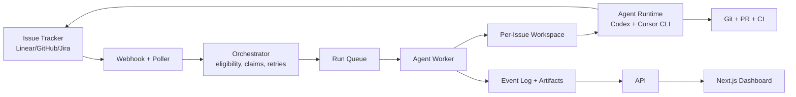

# Agentic Project Management Plan

Status: Draft v0.1
Date: 2026-04-28

## 1. Goal

Build a TypeScript/Node system inspired by OpenAI Symphony: a project management control plane where tickets become autonomous agent runs. Humans manage goals, priorities, approvals, and review. Agents handle implementation attempts inside isolated workspaces, produce proof of work, and keep tickets moving.

This project should feel like a practical agentic engineering manager:

- Turn Linear/GitHub/Jira-style issues into executable work.
- Create one isolated workspace per issue.
- Run a coding agent against the issue with repo-owned workflow instructions.
- Track state, logs, retries, artifacts, PRs, CI, and review feedback.
- Let humans approve, pause, retry, merge, or redirect from a web UI.
- Keep policy and guardrails explicit, versioned, and observable.

## 2. Product Shape

### Working Name

`agentic-project-management`

### Primary Users

- Engineering leads who want to delegate routine implementation work.
- Developers who want agents to work from tickets without babysitting terminals.
- Product/design partners who want to file feature requests and get review packets.

### Core Experience

1. A user creates or labels an issue in a tracker.
2. The orchestrator polls or receives a webhook.
3. Eligible issues are claimed and mapped to deterministic workspaces.
4. The agent runner prepares the workspace, renders the issue prompt, and starts a coding agent.
5. The dashboard shows live run status, logs, costs/tokens, artifacts, blockers, and next action.
6. The agent creates PRs, comments, videos/screenshots, test reports, and follow-up tasks as needed.
7. Humans review the output and approve merge, request changes, pause, or retry.

## 3. Symphony Ideas To Preserve

The OpenAI article and spec suggest several important design principles:

- The issue tracker is the control plane.
- Tickets, not terminal sessions, are the unit of work.
- Every active ticket gets a durable, isolated agent workspace.
- The orchestrator is a scheduler/runner and tracker reader, not the place for all business logic.
- Repo-owned workflow instructions should live in `WORKFLOW.md`.
- Agents should receive objectives, tools, and context rather than only rigid state transitions.
- Guardrails, tests, CI visibility, and proof of work matter more as autonomy increases.
- The system should support bounded concurrency, retries, reconciliation, and operator visibility.

## 4. Recommended TypeScript Stack

### Monorepo

- Package manager: `pnpm`
- Build orchestration: `turbo`
- Language: TypeScript everywhere
- Validation: `zod`
- Lint/format: `eslint`, `prettier`
- Testing: `vitest` for unit/integration, `playwright` for browser flows

### Apps

- `apps/web`: Next.js dashboard and operator UI
- `apps/api`: Node API service using Fastify
- `apps/worker`: long-running orchestrator and agent runner
- `apps/cli`: local operator CLI for bootstrapping, diagnostics, and manual runs

### Packages

- `packages/core`: domain models, state machine, scheduling types
- `packages/config`: `WORKFLOW.md` parser, typed config, live reload
- `packages/trackers`: Linear, GitHub Issues, Jira adapters
- `packages/workspaces`: workspace lifecycle, repo clone/worktree hooks
- `packages/agents`: Codex, Cursor, and generic agent runtime adapters
- `packages/git`: branch, PR, rebase, CI, and merge helpers
- `packages/observability`: logs, traces, events, metrics
- `packages/db`: MongoDB schemas, repositories, and typed data access
- `packages/ui`: shared UI primitives for the dashboard

### Infrastructure

- Database: MongoDB
- Queue: BullMQ on Redis, or Temporal if we want stronger workflow durability
- Object storage: S3-compatible storage for logs, screenshots, videos, artifacts
- Realtime UI: Server-Sent Events or WebSockets
- Auth: NextAuth/Auth.js or Clerk for early product speed
- Secrets: environment variables locally, managed secrets in production
- Deployment: Docker Compose for local, Fly.io/Render/Railway/AWS for hosted

## 5. High-Level Architecture



### Core Boundaries

- Tracker adapters normalize external tickets into one internal `Issue` model.
- Orchestrator decides eligibility, concurrency, retry, cancellation, and reconciliation.
- Worker performs execution, workspace setup, prompt rendering, subprocess control, and artifact capture.
- Agent adapter hides the protocol used to talk to Codex or another coding agent.
- Dashboard is an operator surface, not the source of orchestration truth.

## 6. Core Domain Model

### Issue

- `id`
- `tracker`
- `identifier`
- `title`
- `description`
- `state`
- `priority`
- `labels`
- `assignee`
- `blockedBy`
- `url`
- `repoRefs`
- `createdAt`
- `updatedAt`

### Work Item

Internal representation of an issue that is eligible for agentic execution.

- `id`
- `issueId`
- `projectId`
- `status`: `queued | running | waiting_for_review | blocked | paused | failed | completed | cancelled`
- `desiredState`
- `claimedBy`
- `lastRunId`
- `retryCount`
- `nextAttemptAt`

### Run

- `id`
- `workItemId`
- `attempt`
- `workspacePath`
- `agentRuntime`
- `startedAt`
- `endedAt`
- `status`
- `exitReason`
- `lastHeartbeatAt`
- `tokenUsage`
- `costEstimate`

### Artifact

- `id`
- `runId`
- `type`: `log | patch | pr | screenshot | video | test_report | review_packet | plan`
- `uri`
- `summary`
- `createdAt`

### Event

Append-only operational timeline:

- `id`
- `projectId`
- `workItemId`
- `runId`
- `type`
- `level`
- `message`
- `payload`
- `createdAt`

## 7. Workflow Contract

Each managed repository gets a versioned `WORKFLOW.md`.

Example shape:

```md
---
tracker:
  kind: linear
  project_slug: eng
  active_states: ["Ready for Agent", "Agent Running"]
  terminal_states: ["Done", "Cancelled", "Duplicate"]
polling:
  interval_ms: 30000
workspace:
  root: "$AGENTIC_PM_WORKSPACE_ROOT"
agent:
  max_concurrent_agents: 5
  max_turns: 20
  max_retry_backoff_ms: 300000
codex:
  command: "codex"
  args: ["exec", "--json", "-"]
  approval_policy: "never"
  sandbox: "workspace-write"
  skip_git_repo_check: false
  turn_timeout_ms: 3600000
  stall_timeout_ms: 300000
hooks:
  after_create: |
    git clone git@github.com:org/repo.git .
  before_run: |
    pnpm install --frozen-lockfile
---

You are working on issue {{ issue.identifier }}: {{ issue.title }}.

Use the repo conventions. Run relevant tests. Open a PR when ready.
Leave a concise review packet with:
- summary
- test evidence
- screenshots or video when UI changed
- risks
- follow-up issues
```

Rules:

- Unknown template variables should fail fast.
- Bad config should block new dispatch, not crash the service.
- Config reload should apply to future runs without restarting.
- Secrets should be referenced by env var names, not stored in `WORKFLOW.md`.

## 8. Orchestration State Machine

### Ticket States

Recommended external tracker states:

- `Backlog`
- `Ready for Agent`
- `Agent Running`
- `Human Review`
- `Changes Requested`
- `Blocked`
- `Merging`
- `Done`
- `Cancelled`

### Internal Run States

- `queued`: eligible and waiting for capacity
- `preparing`: workspace and hooks running
- `running`: agent process active
- `stalled`: no event or heartbeat within threshold
- `retrying`: waiting for backoff
- `waiting_for_review`: agent finished and handed off
- `failed`: max retries or hard failure
- `cancelled`: tracker state or operator action stopped execution
- `completed`: accepted, merged, or terminal

### Key Behaviors

- Poll and webhook ingestion both feed the same reconciliation path.
- A ticket is claimed once before dispatch.
- Concurrency is bounded globally and optionally by state/project/repo.
- Blocked tickets do not run until dependencies are terminal or unblocked.
- Stalled/crashed workers are retried with exponential backoff.
- In-flight runs are cancelled when the source issue becomes ineligible.
- Terminal issue cleanup is explicit and audit logged.

## 9. Agent Runtime Strategy

### Phase 1 Runtimes

Codex and Cursor Agent CLI are first-class MVP runtimes. Codex remains the reference runtime because Symphony is centered on Codex orchestration, while Cursor validates that the control plane can orchestrate other popular coding agents through the same adapter boundary.

Adapter responsibilities:

- Validate runtime setup before dispatch.
- Start agent process in the workspace.
- Send rendered prompt.
- Stream normalized events to the worker.
- Capture token/cost/status metadata when available.
- Detect stalls and protocol errors.
- Stop or kill process on cancellation.

### Runtime Interface

```ts
export interface AgentRuntime {
  preflight?(): Promise<AgentRuntimePreflightResult>;
  start(input: AgentStartInput): Promise<AgentSession>;
  run(session: AgentSession, prompt: string): AsyncIterable<AgentEvent>;
  cancel(session: AgentSession, reason: string): Promise<void>;
}
```

Implemented MVP adapters:

- `fake`: safe smoke-test runtime.
- `codex`: CLI process runtime with stdin prompts, heartbeat, timeout, stall detection, and process-group cancellation.
- `cursor`: Cursor Agent CLI runtime using print mode, prompt-as-argument, preflight, and sanitized `stream-json` parsing.
- `generic`: noninteractive CLI wrapper for other tools.

### Future Runtimes

- OpenAI Agents SDK based implementation
- Claude Code or other local CLI agents
- GitHub Copilot Coding Agent integration
- Custom MCP-based tool runner

## 10. Dashboard Plan

Use Next.js as the operator console.

### Views

- Work board: tickets grouped by orchestration status.
- Run detail: logs, events, prompt, workspace metadata, artifacts, PRs, CI.
- Agent fleet: active agents, capacity, queue depth, health, token/cost usage.
- Review packets: generated summaries, test evidence, screenshots/videos, risks.
- Config: projects, tracker credentials, repo mapping, workflow status.
- Audit log: operator actions and agent actions.

### Operator Actions

- Start now
- Pause
- Resume
- Cancel
- Retry
- Assign priority
- Request changes
- Approve handoff
- Approve merge
- Create follow-up issue
- Mark as accepted/rejected

### UI Tone

This should be an operational dashboard: dense, readable, calm, and built for scanning many active runs.

## 11. API Surface

### Public API

- `GET /projects`
- `POST /projects`
- `GET /work-items`
- `GET /work-items/:id`
- `POST /work-items/:id/actions/start`
- `POST /work-items/:id/actions/pause`
- `POST /work-items/:id/actions/resume`
- `POST /work-items/:id/actions/cancel`
- `POST /work-items/:id/actions/retry`
- `GET /runs/:id`
- `GET /runs/:id/events`
- `GET /runs/:id/artifacts`
- `POST /webhooks/linear`
- `POST /webhooks/github`

### Internal Worker API

- Claim work item
- Heartbeat run
- Append events
- Register artifacts
- Release claim
- Schedule retry
- Mark terminal

## 12. Persistence Plan

### MongoDB Collections

- `organizations`
- `users`
- `projects`
- `repositories`
- `tracker_connections`
- `issues`
- `work_items`
- `runs`
- `run_events`
- `artifacts`
- `operator_actions`
- `workflow_snapshots`
- `secrets_references`

### Redis Keys

- Queues: `runs`, `reconciliation`, `cleanup`
- Locks: `claim:<workItemId>`
- Heartbeats: `run:<runId>:heartbeat`
- Rate limit snapshots

### Artifact Storage

- Raw agent logs
- JSON event streams
- Screenshots/videos
- Test reports
- Patch files
- Review packets

## 13. Security And Guardrails

### Execution Isolation

- One workspace per issue.
- Workspace path derived from sanitized issue identifier.
- Run hooks with timeout.
- Allowlist commands in managed environments where needed.
- Run workers in containers for stronger isolation in production.
- Default to least privilege tracker/GitHub tokens.

### Human Control

- Require human approval before merge in MVP.
- Require human approval for destructive actions.
- Show all agent-authored PRs and issue updates.
- Log every operator and agent action.

### Secret Handling

- Never write secret values into prompts, logs, or artifacts.
- Redact known token patterns from event streams.
- Reference secrets by environment variable or managed secret IDs.

### Repository Safety

- Create branches with predictable prefixes.
- Never push directly to protected branches.
- Use CI status as merge gate.
- Preserve workspace evidence for failed attempts.

## 14. MVP Scope

### MVP 1: Local Orchestrator

Deliver a local-only system that can run against one repo and one tracker.

- `WORKFLOW.md` parser
- Linear adapter
- Polling loop
- Workspace manager
- Codex and Cursor CLI runners
- Structured logs
- MongoDB persistence
- Basic CLI commands
- Manual retry/cancel

Success criteria:

- A Linear issue in `Ready for Agent` starts an isolated run.
- The agent can create a branch/PR.
- Logs and run status are visible from CLI or simple web page.

### MVP 2: Web Dashboard

- Next.js operator UI
- Work board and run detail
- Realtime logs
- Artifacts list
- Operator actions
- Auth for one team

Success criteria:

- Humans can manage active runs from the browser.
- Review packets are visible beside PR/test evidence.

### MVP 3: Production Hardening

- Worker queues
- Webhooks plus polling reconciliation
- Retry/backoff
- Stall detection
- CI watcher
- Merge gate
- Audit log
- Docker Compose
- Basic deployment docs

Success criteria:

- Service recovers after restart.
- Duplicate runs are avoided.
- Stalled jobs retry or fail cleanly.

### MVP 4: Multi-Repo/Multi-Tracker

- GitHub Issues adapter
- Jira adapter
- Repo routing rules
- Dependency DAG execution
- Project-level concurrency
- Follow-up issue creation

Success criteria:

- Larger roadmap items can be decomposed into dependent tasks.
- Unblocked tasks run in parallel.

## 15. Suggested Initial Repository Structure

```txt
agentic-project-management/
  docs/
    PLAN.md
    ARCHITECTURE.md
    WORKFLOW_SPEC.md
    SECURITY.md
    MVP_CHECKLIST.md
  apps/
    web/
    api/
    worker/
    cli/
  packages/
    core/
    config/
    trackers/
    workspaces/
    agents/
    git/
    observability/
    db/
    ui/
  examples/
    workflow/
      WORKFLOW.md
  docker/
    docker-compose.yml
  package.json
  pnpm-workspace.yaml
  turbo.json
  tsconfig.base.json
```

## 16. First Implementation Sprint

### Day 1: Scaffold

- Create pnpm/turbo monorepo.
- Add TypeScript, linting, tests.
- Add Fastify API skeleton.
- Add worker skeleton.
- Add Next.js dashboard skeleton.

### Day 2: Workflow Loader

- Implement `WORKFLOW.md` discovery.
- Parse YAML front matter.
- Validate with `zod`.
- Render prompt with Liquid-compatible template semantics.
- Add tests for missing file, bad YAML, unknown variables, defaults.

### Day 3: Tracker Adapter

- Implement normalized `Issue` model.
- Build Linear GraphQL client.
- Fetch active issues.
- Normalize blockers, labels, priority, state.
- Add fake tracker adapter for tests.

### Day 4: Orchestrator

- Poll on interval.
- Claim eligible issues.
- Enforce global concurrency.
- Schedule run jobs.
- Reconcile terminal/ineligible issues.
- Add retry/backoff primitives.

### Day 5: Workspace Manager

- Create deterministic workspace paths.
- Run `after_create`, `before_run`, `after_run`, `before_remove` hooks.
- Add timeout and event logging.
- Preserve workspaces across retries.

### Day 6: Agent Runner

- Implement `AgentRuntime` interface.
- Add Codex, Cursor, and generic CLI adapters.
- Add runtime setup preflight.
- Parse Cursor `stream-json` into sanitized events.
- Parse Codex `exec --json` into sanitized events.
- Stream events into persistence.
- Detect stall and timeout.
- Support cancellation.

### Day 7: Operator Loop

- Add run detail API.
- Add minimal dashboard with active runs and logs.
- Add retry/cancel actions.
- Add review packet artifact model.
- Write setup docs.

## 17. Open Decisions

- Should the first tracker be Linear only, or Linear plus GitHub Issues?
- Should persistence use local MongoDB from day one, or MongoDB Atlas for the first hosted version?
- Should workers run directly on the host or inside Docker containers first?
- Which runtime should be added after Codex, Cursor, and generic CLI support?
- Should merge be manual-only in MVP, or allow approval-gated automatic merge?
- Should the product be single-tenant local first or hosted multi-tenant from the beginning?

## 18. Risks

- Agent autonomy without strong tests can create noisy or low-quality PRs.
- Long-running local workspaces can accumulate disk usage.
- Tracker webhooks can be missed, so polling reconciliation remains necessary.
- Prompt and workflow config changes can break future dispatches.
- Running coding agents requires careful sandbox, token, and command policy.
- UI can become a passive log viewer unless operator actions are designed clearly.

## 19. Build Order Recommendation

Start with a local, trusted-environment implementation:

1. `WORKFLOW.md` parser and typed config.
2. Fake tracker adapter and deterministic orchestrator tests.
3. Linear adapter.
4. Workspace manager.
5. Codex, Cursor, and generic CLI runtime adapters.
6. Event persistence and logs.
7. Minimal dashboard.
8. Retry/stall/cancel behavior.
9. CI/PR/review packet integration.
10. Containerized worker isolation.

This keeps the first version close to Symphony's essence while making room for a richer TypeScript product surface.

## 20. References

- OpenAI article: https://openai.com/index/open-source-codex-orchestration-symphony/
- OpenAI Symphony repository: https://github.com/openai/symphony
- Symphony service specification: https://github.com/openai/symphony/blob/main/SPEC.md
